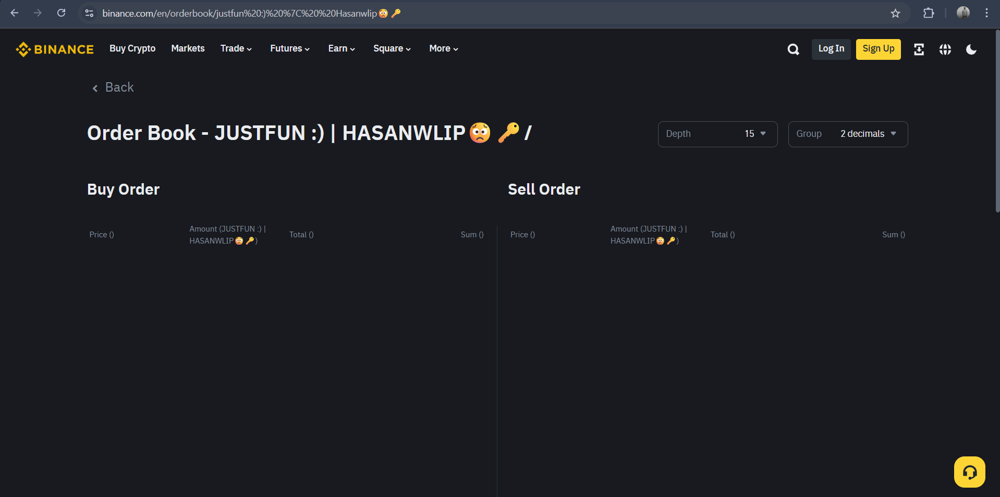

<h1 align="center">🛡️ Binance Order Book UI Injection Bug</h1>


<p align="center">
  <strong>HACKED BY HASANWLIP - Proof of Concept (PoC)</strong><br>
  ⚠️ A visual injection bug on Binance that allows arbitrary text rendering via the URL path.
</p>

---

## 📌 Summary

This repository documents a **UI injection vulnerability** discovered on Binance’s `order book` page. It allows attackers to insert **arbitrary text into the page interface** using a modified URL.

🖼️ The string `HACKED BY HASANWLIP` appears in:

* The **page title**
* **Table headers** (Buy/Sell orders)
* Inside a fully legitimate **binance.com** page

---

## 🚀 Proof of Concept (PoC)

### 🗭 Steps to Reproduce

1. Open the following URL in your browser:

   ```
   https://www.binance.com/en/orderbook/hacked%20by%20hasanwlip%F0%9F%92%B5
   ```

2. Expected visual outcome:

   * `Order Book — HACKED BY HASANWLIP` appears at the top
   * Table columns include:

     * `Amount (HACKED BY HASANWLIP)`
   * All without any login, session, or user privileges.

3. ✅ **Screenshot of the result:**

   

---

## 🌟 Impact

| Risk Level            | Description                                                                                                |
| --------------------- | ---------------------------------------------------------------------------------------------------------- |
| ⚠️ **Medium**         | While this bug does not compromise user accounts or backend data, it presents a **serious phishing risk**. |
| 🎝️ **Spoofing Risk** | Can be exploited to trick users into believing Binance has been hacked or compromised.                     |
| 📸 **Fake Visuals**   | Attackers could use screenshots for misinformation campaigns.                                              |

---

## 🔬 Technical Analysis

* The route `/orderbook/:pair` injects the path segment directly into UI elements.
* No sanitization or validation is applied on route value.
* Appears to affect:

  * `<title>` tag of the page
  * Column headers within the order book table

```js
// Likely logic (simplified):
const pair = getPairFromRoute();  // e.g., "hacked by hasanwlip"
renderTitle(`Order Book — ${pair}`);
```

---

## ✅ Recommended Fix

* 🔐 Sanitize any user-supplied path variables before rendering
* ✅ Enforce allow-listed market pairs only (e.g., BTC/USDT)
* 🔀 Escape HTML-sensitive characters before injecting to DOM

---

## 📟 Disclosure Timeline

| Date         | Event                                  |
| ------------ | -------------------------------------- |
| `YYYY-MM-DD` | Vulnerability discovered by @hasanwlip |
| `YYYY-MM-DD` | Reported to Binance Bug Bounty Team    |
| Pending      | Awaiting triage / response             |

---

## 🗃️ Repository Content

| File                 | Description                          |
| -------------------- | ------------------------------------ |
| `README.md`          | Full documentation                   |
| `PoC_Screenshot.png` | Screenshot showing the bug in action |

---

## 👤 Reported By

<p align="center">
  <strong>@HASANWLIP</strong><br>
  <a href="https://github.com/hasanwlip">GitHub</a> •
  <a href="https://t.me/gngnow">Telegram</a>
</p>

---

> ⚠️ This vulnerability has been reported responsibly. No data was tampered with, and no backend systems were affected.
